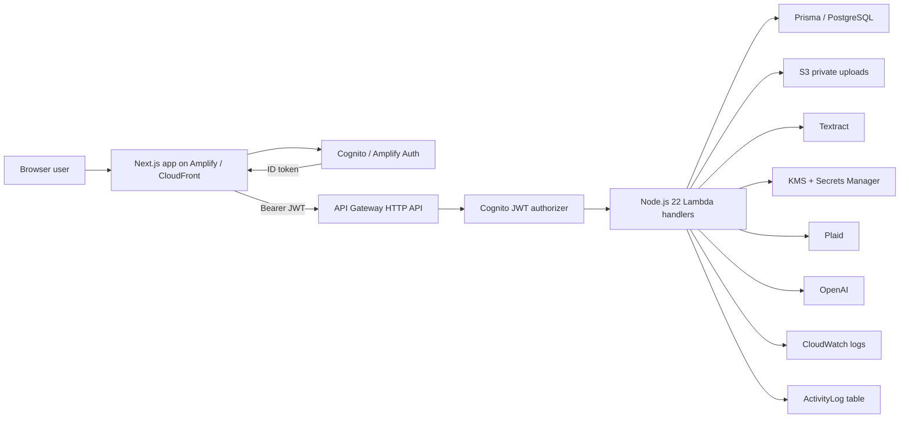
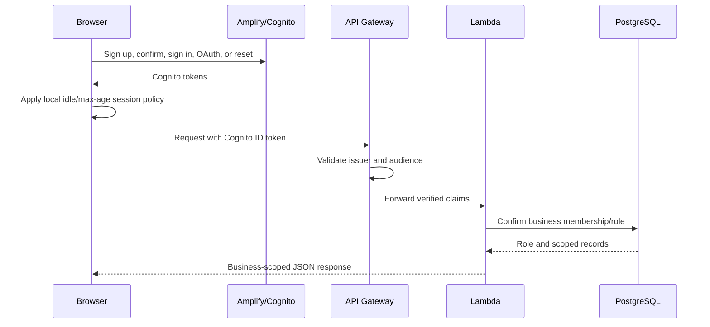

# System architecture

## Proven repository architecture

| Layer | Implementation | Evidence |
|---|---|---|
| Web | Next.js 16.1.1 App Router, React 19.2.3, TypeScript, Tailwind 4 | `bynkbook-web/package.json`, `src/app` |
| Client state | TanStack Query plus local React state/localStorage | query hooks and page clients |
| Authentication client | AWS Amplify Auth 6 with Cognito user pool, hosted UI, and Google OAuth | `src/lib/auth/amplify.ts` |
| API client | `apiFetch`, Cognito ID token bearer auth, retry-on-401, 30-second timeout | `src/lib/api/client.ts` |
| API | SST v3 `ApiGatewayV2`, 148 HTTP routes, JWT authorizer | `infra-sst/sst.config.ts` |
| Compute | 49 Node.js 22 Lambda handler exports; most database handlers run in VPC | SST route definitions |
| Database | PostgreSQL, Prisma 7, 27 models, Secrets Manager URL/CA, TLS verification | Prisma schema and `lib/db.ts` |
| Files | Private S3 keys, presigned PUT/GET, KMS permissions, Textract expense analysis | uploads handler and SST permissions |
| Bank integration | Plaid link/exchange/status/sync/webhook; access tokens encrypted with KMS | Plaid handlers/service |
| AI | OpenAI-backed explanation/chat/anomaly/category workflows plus deterministic scoring | AI handlers and OpenAI dependency |
| Hosting | AWS Amplify/CloudFront for `app.bynkbook.com` according to repo operations docs | `docs/production-bridge-current-state.md` |
| Observability | Lambda console logs and activity-log table; no alarms/access-log configuration found in IaC | SST config and `ActivityLog` model |
| Delivery | GitHub repository feeding Amplify `main`; no repository GitHub Actions workflow found | repo files and operations docs |

## Data flow

## Frontend structure

- Public/auth routes: `/`, `/login`, `/signup`, `/confirm-signup`, `/forgot-password`, `/reset-password`, `/oauth-callback`, `/accept-invite`, `/privacy`, `/terms`, `/create-business`.
- Authenticated desktop routes: dashboard, ledger, reconcile, issues, category review, closed periods, planning, reports, vendors, settings, category migration, accounts redirect, and a dev dialog gallery.
- Authenticated mobile routes: mobile home, invoice capture, receipt capture, issue queue, review queue, uncategorized queue, and vendors.
- `AppShellInner` performs client-side user/session checks, business/account selection, navigation, search, activity, and responsive chrome.
- Server components mainly wrap large client page implementations; the largest are reconcile (7,521 lines), ledger (5,951), and settings (4,007).

## Backend structure

The API defines 148 method/path combinations and 49 unique handler exports. API Gateway performs JWT verification for every route except `/v1/health` and the Plaid webhook. Handlers then repeat business membership and role checks before querying Prisma. This provides defense in depth but distributes authorization rules across many files.

Most database handlers reuse a shared configuration that grants Secrets Manager/KMS access, VPC networking, log permissions, 20-second timeout, and 512 MB memory. Plaid routes add Plaid secret and KMS permissions; upload routes add S3, KMS, and Textract permissions. There is no monolithic backend service: each route is provisioned as serverless compute through SST.

## Authentication lifecycle

The client prefers the ID token because the API authorizer audience is the Cognito app client. Tokens are managed by Amplify, not manually persisted by application code. A localStorage policy adds an application-level idle/max-age sign-out. Protected routes redirect to `/login?next=...`; `sanitizeAuthNext` blocks external redirect origins.

## Database and relationships

The 27 Prisma models cover businesses and memberships; accounts and entries; categories and category memory; uploads; Plaid connections and bank transactions; direct matches and match groups; transfers; issues; reconciliation snapshots; invites and role policies; activity; closed periods; vendors, bills, and payment applications; budgets and goals.

Tenant isolation is represented by `business_id` on business-owned models, composite indexes, membership checks, and scoped queries. PostgreSQL foreign keys and cascades enforce many parent/child relationships. There is no separate migration service; SQL migrations live under `infra-sst/prisma/migrations` and deployment status could not be checked.

## Production bridge warning

Repository operations documentation says the live system intentionally mixes prod-named and dev-named resources: a dev-named RDS instance, S3 bucket, Cognito pool/client, and KMS alias serve production through prod-named secrets and a prod API. This audit did not independently verify that deployed topology because the required AWS profile was unavailable. Treat the documented bridge as operational history, not newly verified fact.

## Environment boundaries

- Local development uses `.env.local` and the dev API.
- A tracked `.env.production` contains placeholder/stale values and is not reliable deployment truth.
- Repository docs say Amplify production environment variables point the built app at `cpjh7t19u1`.
- The live JavaScript bundle was independently found to contain `https://cpjh7t19u1.execute-api.us-east-1.amazonaws.com`.
- The audit brief's `actwy6st05` hostname did not resolve during safe HTTP checks.

## Monitoring and recovery

Activity logs provide application-level audit history. Lambda code emits console logs for selected errors. Prior repository documentation says RDS backups retain seven days and most Lambda log groups retain 30 days, but current deployed settings, alarms, failed invocations, throttling, and recovery readiness remain unverified. SST code does not define alarms, WAF/rate limits, API access logs, or database resources/backups.
