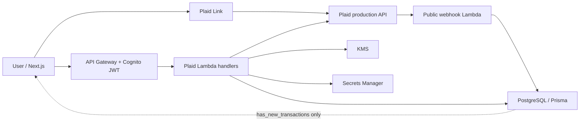
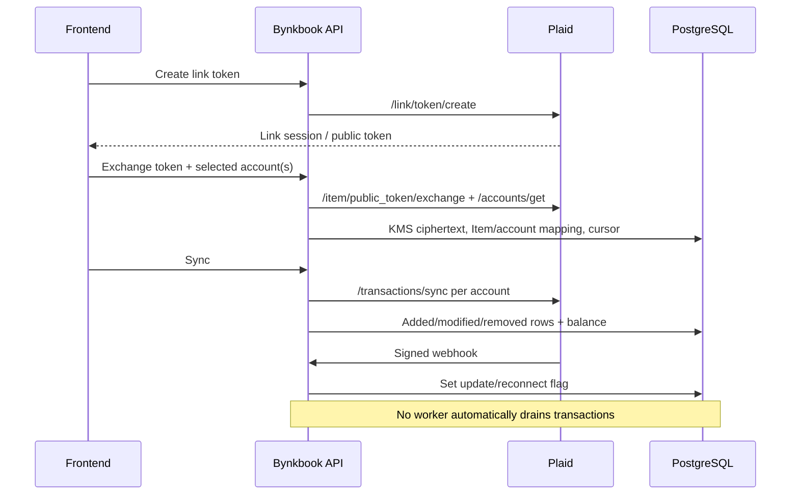

# Plaid System Architecture

## Deployed shape

- Next.js frontend calls 12 direct Plaid API routes; a thirteenth Plaid-related route cleans import overlap.
- API Gateway uses Cognito JWT authorization on every direct route except the public webhook.
- Twelve endpoint handlers call three shared Plaid modules: `plaidService.ts`, `plaidClient.ts`, and `plaidCrypto.ts`.
- Lambdas run Node.js 22 in private VPC networking against PostgreSQL through Prisma.
- Plaid credentials come from Secrets Manager; access tokens are KMS-encrypted before PostgreSQL storage.
- There is no Plaid EventBridge schedule, sync queue, or DLQ. Webhooks update connection flags only.

## Lifecycle

Token lifecycle: a short-lived Link token reaches the browser; the public token reaches the authenticated backend; the access token never returns to the browser and is stored encrypted. Update mode decrypts the same access token and supplies it to Link-token creation, preserving the Item.

Item/account lifecycle: one Item may back multiple `BankConnection` rows. Each row has a per-account Plaid ID and packed cursor. A local account can be created manually and later linked, or created from a reviewed Plaid selection. Disconnect currently deletes only one local mapping. No code calls `/item/remove` when the final mapping is removed.

Transaction lifecycle: sync requests `/transactions/sync` with an account ID, applies added/modified/removed changes, upgrades a pending row when Plaid provides `pending_transaction_id`, fetches balance, then clears the webhook flag. Reconciliation creates explicit active `MatchGroup` records; ledger queries derive matched activity from active groups rather than silently posting suggestions.

Recovery lifecycle: Item errors set reconnect state. Update-mode Link repairs credentials on the same Item. The selected live account can then replace the stored Plaid account mapping; compatibility with the original account is not checked (BYNK-PLAID-AUDIT-005).
