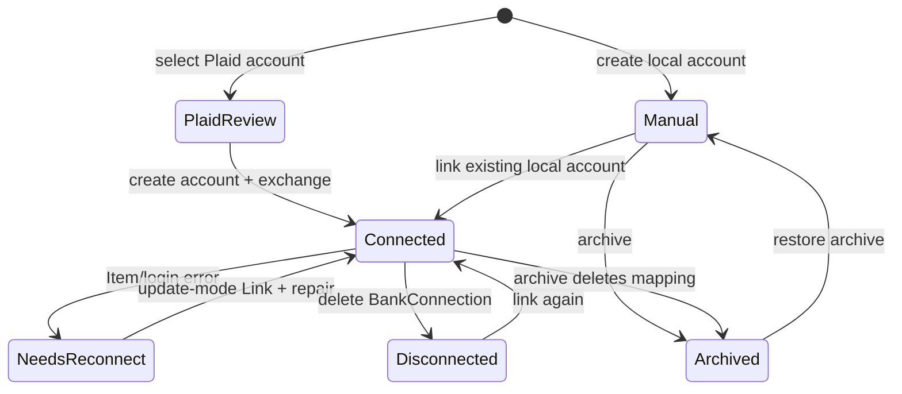

# Account Lifecycle Map

## Stored account types

Five types are accepted and stored: `CHECKING`, `SAVINGS`, `CREDIT_CARD`, `CASH`, and `OTHER`. Plaid type/subtype is shown during selection but is not persisted as an immutable identity constraint. Currency compatibility is not enforced during repair.

## States and transitions

`BankConnection.status` principally represents `CONNECTED` or reconnect/error conditions; `has_new_transactions` is a separate update flag. Transactions survive normal disconnect and archive. Opening-policy state is `AUTO` or `MANUAL`, with stored suggestions and an effective start date.

Creation paths:

- Manual: authenticated account endpoint, explicit account type and opening fields.
- New from Plaid: business Link, reviewed selection, local account create, public-token exchange, sync.
- Existing local account: account-scoped Link, exchange, sync, opening preview/apply.
- Multi-account: a primary local account plus additional local accounts/connections created sequentially.

Deletion behavior:

- Account disconnect deletes the local `BankConnection`, preserving `BankTransaction` history.
- Archive also removes the local connection mapping.
- Cancel during opening application deletes the mapping.
- None of those paths removes the Plaid Item; final-Item lifecycle is incomplete (BYNK-PLAID-AUDIT-009).
- `change-opening-date` hard-deletes older Plaid rows after confirmation and can orphan active group links (BYNK-PLAID-AUDIT-002).

Account ownership is business-scoped and cross-tenant account access checks were found. The flaw is role depth inside a business: Plaid financial mutations require membership but not an appropriate write policy (BYNK-PLAID-AUDIT-013).
